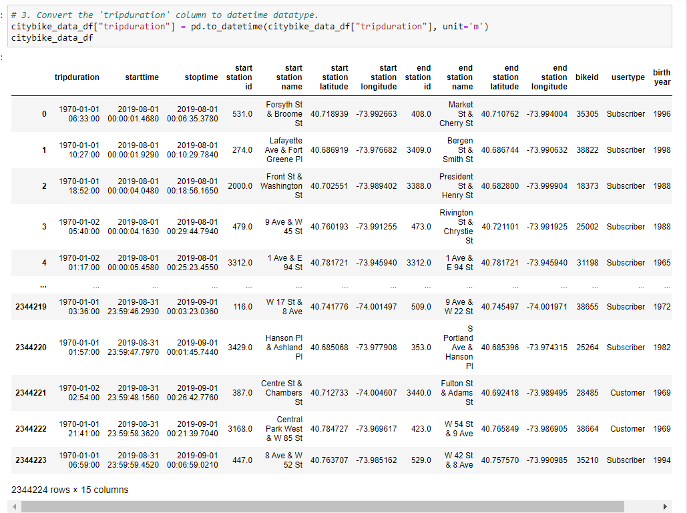
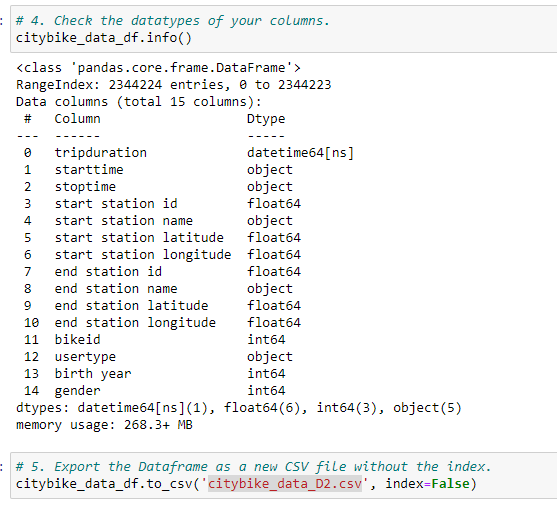

# Bike Sharing

## Overview of the statistical analysis:

Use data from the Citi Bike program in New York City for August 2019 was retrieved from 
[ride.citibikenyc.com](https://s3.amazonaws.com/tripdata/index.html). The data was transformed using andas to change the datatype of the "tripduration" column from an integer to a datetime datatype to get the time in hours and minutes.

[datatype transformation for "tripduration"](Resources/tripduration.PNG)

## Results:

###  Link to Dashboard
[CitiBikeChallenge_CitiBikeUsageStoryboard]( https://public.tableau.com/views/CitiBikeChallenge_CitiBikeUsageStoryboard/CitiBikeUsageStoryboard?:language=en-US&:display_count=n&:origin=viz_share_link)

### Seven visualizations

* Customer Profile: Gender

    Most users are male

* Customer Profile: Type

    Most usage comes from suscribers

* Peak Hours

    5pm to 6pm

    Usage by female clients is drastically reduced after hours.

* Checkout Times for Users
    
    Most check outs under 30min
  
* Checkout Times for Genders

    Most check outs under 30min

* Trips by Weekday per Hour

    Weekday usage: peak at commute hours 8am and 5pm-6pm except for Wednesdays. 

* Trips by Gender (Weekday per Hour)

    Overall, less female usage but similar pattern as male usage.

* Trips by Gender by Weekday

    Non subscriber (customer) usage higher over the weekends. 

## Summary

* Most subscriber usage seems to be from work commute while most non-subscriber (customer) users  seem to be from weekend users. This should be considered when deciding on new locations since work commute seems like a significant amount of the usage. 

* Additional visualizations for future analysis

    Average Trip Duration per gender
  
    Top Starting/Ending Locations per gender
